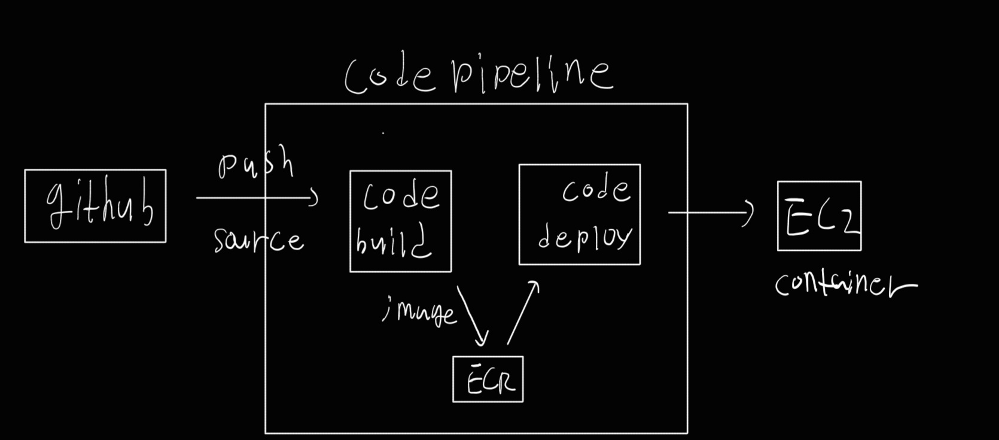

현재 About은 Heroku를 이용해서 배포를 진행하고 있습니다.
지난번에 비용 분석을 했을 때, Heroku에서 AWS로 옮기면 한달에 약 $84를 아낄 수 있겠다는 예측이 나와서, 실제로 AWS상에 CI/CD파이프라인을 구성해보았습니다.

# 구성

사용한 툴은 다음과 같습니다.
- AWS-ec2: Docker container를 실행하고 요청을 받는 주체
- AWS ECR: Docker image의 저장소
- AWS codebuild: buildspec.yml을 통해 Docker image를 빌드하고 ECR에 푸쉬
- AWS codedeploy: ECR에서 컨테이너를 가져와 EC2에서 실행 
- AWS codepipeline: github코드 트래킹, build, deploy과정을 pipeline으로 만들어 실행
- AWS-s3: pipeline의 각 과정 결과 저장
- AWS-IAM: 각 과정의 권한 설정

간단히 도식화 해보면 아래와 같습니다.

# 비용 분석

처음 비용 예측을 할 때는 AWS 인스턴스와 저장소 비용, IP 주소 비용 정도만 포함해서 계산했는데, 그것보다는 구조가 복잡해져서 다시 비용 분석을 해보겠습니다.

## AWS EC2
Ubuntu 이미지에 ram 4Gib를 지원하는 t2.miedium을 사용. 시간당 $0.0576가 청구된다.

한달에, 0.0576 * 24 * 30 = $41.472가 청구된다.

## Elastic IP

매월 약 $3.5가 청구된다.

## EBS 볼륨

GB당 월 $0.0912
70GB 사용을 가정하면, 한달에 약 $6.5 비용 발생

## Elastic Container Registry

GB당 월 0.10.
10GB정도 사용한다 가정하면 한달에 약 $1 의 비용 발생

## AWS Codebuild

codebuild는 build 분당 요금을 청구한다. 어떤 인스턴스를 사용하는지에 따라 다르지만, 대충 분당 $0.01가 청구된다고 생각하면 될 것 같다.

빌드하는데 3분이 걸린다 가정하고, 하루에 2번 빌드가 진행된다 가정하자. 이는 매우 보수적으로 잡은 수치이다.
0.01 * 3 * 2 * 30 = $1. 한달에 약 $1가 청구된다.
프론트엔드 백엔드 각각이라 생각하면 한달의 $2가 청구될 것이다.

## AWS Codedeploy

codedeploy는 업데이트당 $0.02의 요금을 부과한다.
위에서와 마찬가지로 하루에 2번씩 배포된다 가정하자. 프론트 백, 두개를 생각하면

0.02 * 2 * 30 * 2 = $2.4의 비용이 매달 청구된다.

## AWS codepipeline

codepipeline은 파이프라인당 매월 $1를 청구한다.
2개의 pipeline을 만들 것이므로 매월 $2가 청구된다.

## AWS S3

GB당 매월 $0.023가 청구된다.
codepipeline과정에서 저장되는 양은 엄청나게 작으므로 고려하지 않아도 될 것 같다.

# 총 비용

41.5 + 3.5 + 6.5 + 1 + 2 + 2.24 + 2 = 대략 60

한달에 $60 정도의 비용을 생각하면 될 것 같다.

Heroku 배포가 매월 $130였으므로, $70 = 약 10만원을 매달 아낄 수 있다.