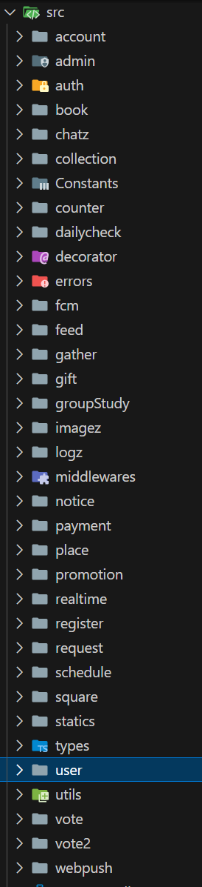
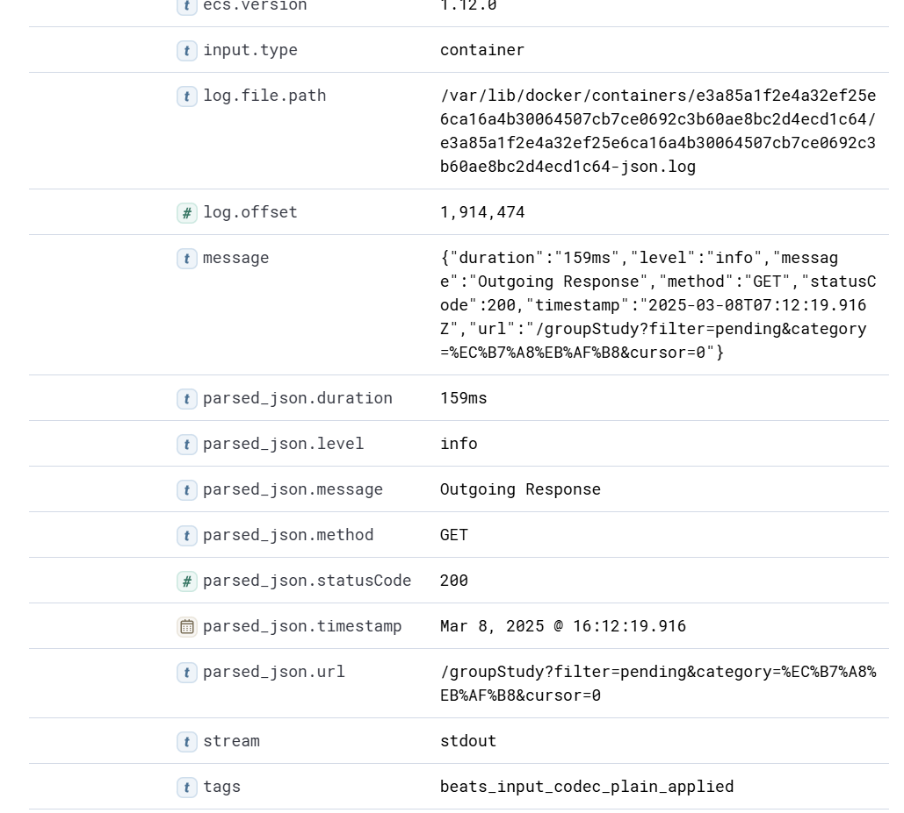
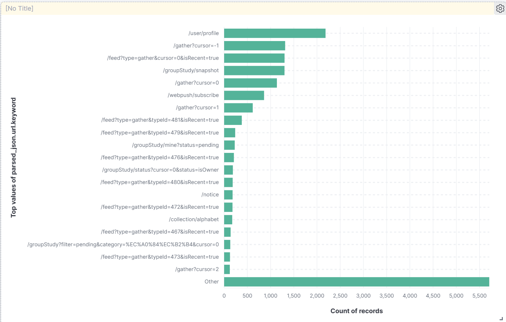

# 왜 MSA의 적용이 필요할까?

About에는 현재 20개에 가까운 다양한 Route들이 존재합니다.

그러나 모든 API에 고르게 요청이 들어가지는 않습니다. 주요 기능이나, user 등 특정 api에 요청이 몰릴것임을 쉽게 짐작할 수 있습니다.

Monolithic architecture를 사용하면 요청이 많이 몰릴 때, 전제 Application이 영향을 받기 때문에 이상적이지 않습니다.

그래서 어떤 API에 요청이 많이 들어오는지 ELK 스택을 활용해 분석하고, MSA를 적용해보기로 했습니다.

# API 요청이 들어올때 로깅을 해보자.

API 요청이 들어올 때 로깅을 하는 방법은 다양합니다.

예를 들어, application에서 모든 요청에 적용되는 AOP혹은 middleware를 두고 로깅을 할 수도 있고, Nginx의 로그를 가져와 활용할 수도 있습니다.

Nginx의 로그를 활용하는 방법은 ELK의 설정 수정과 추가적인 필터링이 필요하므로 저는 전자의 방법을 사용했습니다.

먼저, 사용중인 Nest.js 코드에 middleware를 추가해줍시다.
```typescript
@Injectable()
export class LoggingMiddleware implements NestMiddleware {
  constructor(
    @Inject(WINSTON_MODULE_PROVIDER) private readonly logger: LoggerService,
  ) {}
  
  use(req: Request, res: Response, next: NextFunction) {
    const startTime = Date.now();
  
    // 요청 로깅 (JSON 형식)
    this.logger.log({
      timestamp: new Date().toISOString(),
      level: 'info',
      message: 'Incoming Request',
      method: req.method,
      url: req.originalUrl,
      ip: req.ip,
      userAgent: req.headers['user-agent'],
      body: req.body,
    });
}
```

NestMiddleware를 구현하며 use에 로깅을 추가해주면 됩니다.
그 다음 app.module에 middleware를 적용해줍시다.

``` typescript
export class AppModule implements NestModule {
  configure(consumer: MiddlewareConsumer) {
    consumer
      .apply(
        LoggingMiddleware,
        helmet(),
        compression(),
        // cors(corsOptions),
        TokenValidatorMiddleware,
      )
      .exclude(
       { path: 'payment/portone-webhook', method: RequestMethod.POST }, // 특정 경로 제외
      )
      .forRoutes('*');
  }
}
```

이렇게 middleware를 적용해주면, 이제부터 모든 api 요청이 로깅될 것입니다.
저는 Docker container 형태로 배포 중이므로, Docker log에 기록되고, ELK가 이를 수집 하고 있으니 이제 Kibana에서 해당 로그들을 확인할 수 있습니다.

# ELK에서 API요청을 시각화 해보자.

api로깅을 해뒀으므로,
kibana discover에서 아래와 같은 데이터가 들어오고 있는걸 확인할 수 있었습니다.
이제 이 데이터를 시각화 해서 어떤 요청이 많이 들어오고 있는지 확인해봅시다.


위의 값을 보면 parsed_json.url 값을 사용하면 어떤 요청이 많이 들어오는지 확인할 수 있을것으로 보입니다.

kibana에서 특정 필드를 집계하여 시각화하기 위해서는 해당 필드를 keyword 타입으로 저장해야 합니다.

default로는 text 타입으로 저장되는데, text 타입은 토큰화되어 저장되므로 그 값 자체를 사용해서 집계가 불가능합니다. keyword 타입으로 저장하면 문자 전체를 저장하기 때문에 그대로 사용 가능합니다.

kibana Dev tools에서 아래 명령을 통해 keyword 타입으로 저장할 수 있습니다.
```shell
PUT _index_template/logs_template
{
  "index_patterns": ["nest-logs-*"], 
  "priority": 10,
  "template": {
    "mappings": {
      "properties": {
        "parsed_json.url": {
          "type": "keyword"
        }
      }
    }
  }
}
```

이제 parsed_json.url 값을 이용해 Kibana dashboard에서 시각화 해봅시다.
Dashboard에서 parsed_json.url 필드를 끌어 놓고, Bar horizontal Type으로 분석해보니 아래와 같은 결과를 얻었습니다.



About은 메인 페이지에서 GroupStudy, Gather데이터를 가져오고 있으므로, 이 요청들이 많이 들어오는 걸 확인할 수 있습니다.
User 정보도 조회할 일이 많으니 /user/profile에 대한 요청도 많이 들어오네요.

대부분의 요청이 /user, /gather, /groupstudy, /feed를 통해 들어오므로, 만약 분리한다면 이 module들을 위주로 분리하면 좋겠네요!