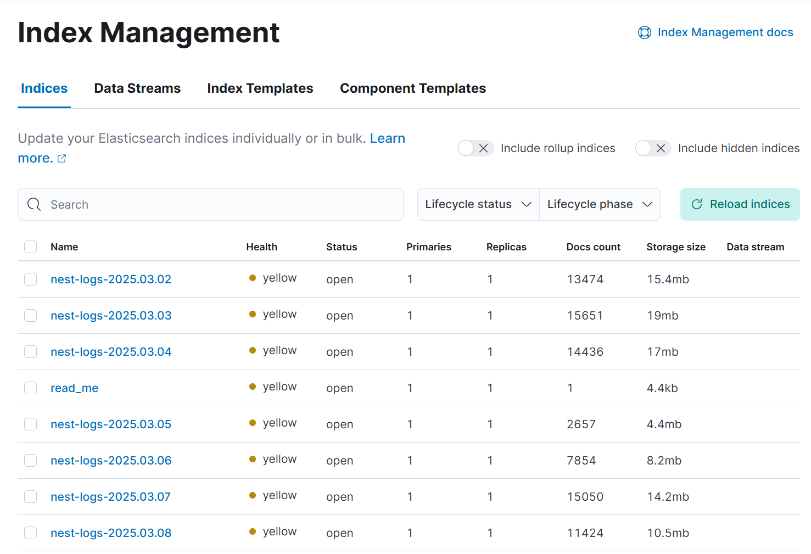
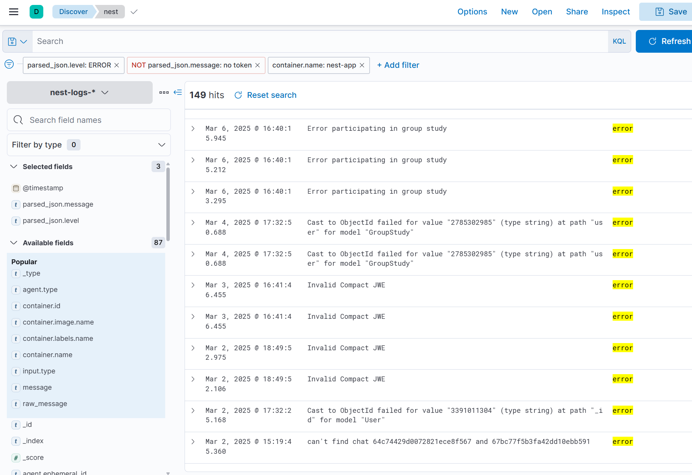

# Error 로깅과 모니터링의 중요성
서비스를 운영하며 가장 중요하게 생각된 부분은 서비스를 장애 없이 운영하는 것이었습니다.
Express.js에서 Nest.js로 코드를 porting하며 처음에 가장 문제가 됐던 부분은 에러 발생시 백엔드가 종료돼버리는 것이었습니다.
처음에는 종료되는 에러가 발생하면 처리하는 식으로 해결해보려 했는데, 계속 서버가 종료되는걸 그냥 둘 수 없었습니다.

서비스가 예기치 않게 종료되는건 Error가 제대로 Handling 되지 않아서 인데, Nest.js에서 처리되지 않은 Error를 Handling할 수 있는 Listener를 제공합니다.
main.ts에 다음과 같은 코드를 추가하여 해결할 수 있었습니다.
```
//전역 에러 핸들링
process.on('unhandledRejection', (reason, promise) => {
  logger.error('🔥 Unhandled Rejection', { promise, reason });
});
  
process.on('uncaughtException', (error) => {
  logger.error('🔥 Uncaught Exception', { error });
});
```
일단 급한불은 껐지만 얼른 에러에 대한 처리를 해주고, 에러가 발생할 때마다 바로 바로 대응이 가능하도록 하고 싶었습니다.

# 왜 ELK 스택은 선택했을까?

1. ELK는 Open source입니다. Splunk와 같은 다른 유료 서비스와 비교했을 때, 무료로 사용할 수 있는 ELK 스택이 서비스에 맞았습니다.
2. Docker container의 로그를 수집할 수 있고, ElasticSearch 기반으로 빠른 검색 성능을 보유하고 있습니다.
3. Kubernetes를 사용하고 있지 않습니다. Kubernetes를 사용중이라면, Prometheus, Grafana같은 다른 서비스도 고려해봤을 수 있지만, ELK가 가장 간편하게 사용할 수 있었습니다.

# ELK란 무엇일까?
ELK란 ElasticSearch, Logstash, Kibana 라는 세가지 인기있는 데이터 처리 솔루션을 일컫는 말입니다.

ElasticSearch는 검색 및 분석
Logstash는 데이터 수집
Libana는 데이터 시각화

이렇게 각각 담당합니다.

# Docker-compose로 ELK 구성하기

About은 Frontend와 Backend를 Docker Container로 배포하고 있습니다.
ELK를 Docker conatiner로 띄우고, Docker의 로그를 수집하는 과정을 구성해봅시다.

여기선 Container의 로그를 Logstash로 전송해주기 위해 추가로 Filebeat을 사용합니다.

ELK는 현재 8.xx 버전까지 나와있지만, 8버전 이상부터는 보안 문제를 해결하려면 무료 사용에 제한이 있어 7버전을 사용했습니다.

현재 저희는 AWS의 RAM 4GB, 100GB 디스크의 인스턴스를 사용중입니다. 
제한된 환경에서 ELK 스택을 사용하기 위해 다음과 같은 사항을 주로 고려했습니다.
- 수집하는 log의 양 제한.
- ELK의 각 stack의 메모리 사용량 제한.
- 특정 기간이 지난 로그는 삭제
## Elasticsearch
```
elasticsearch:
    image: docker.elastic.co/elasticsearch/elasticsearch:7.17.27
    container_name: elasticsearch
    environment:
      - discovery.type=single-node
      - "ES_JAVA_OPTS=-Xms512m -Xmx512m"
      - xpack.security.enabled=false  # 데모용. 프로덕션에서는 보안 설정 권장
      - xpack.license.self_generated.type=basic
      - http.cors.enabled=true  # CORS 활성화
      - http.cors.allow-origin="*"
      - http.cors.allow-methods=OPTIONS,HEAD,GET,POST,PUT,DELETE
      - http.cors.allow-headers=X-Requested-With,X-Auth-Token,Content-Type,Content-Length,Authorization
      - http.cors.allow-credentials=true
      - xpack.security.authc.api_key.enabled=false  # API Key 인증 비활성화
      - xpack.security.authc.anonymous.roles=superuser  # 익명 사용자에게 슈퍼유저 권한 부여
    volumes:
      - es-data:/usr/share/elasticsearch/data
    ports:
      - "9200:9200"
```
- 보안 관련 설정을 비활성화했으므로, 누구나 접근할 수 있습니다. 실제 배포 환경에서는 보안 설정을 해야합니다.
- Cors 설정을 활성화했습니다.
- 익명 사용자가 superuser 권한을 가집니다. 이 또한 실제로는 수정해야 합니다.
- 메모리 사용량을 512mb로 제한합니다.

5일이 지난 데이터를 삭제하고, 일별로 로그를 관리하기 위해, docker-compose가 시작할 때 ilm 정책을 적용해 줬습니다.

```
# 1) ILM 정책 생성
echo "=== Create ILM policy ==="
curl -X PUT "http://elasticsearch:9200/_ilm/policy/delete-after-5d" \
     -H 'Content-Type: application/json' \
     -d '{
       "policy": {
         "phases": {
           "hot": {
             "actions": {
               "rollover": {
                 "max_age": "1d",
                 "max_size": "1gb"
               }
             }
           },
           "delete": {
             "min_age": "5d",
             "actions": {
               "delete": {}
             }
           }
         }
       }
     }'

# 2) 인덱스 템플릿에 ILM 적용 예시
echo "=== Create index template with ILM ==="
curl -X PUT "http://elasticsearch:9200/_index_template/logs_template" \
     -H 'Content-Type: application/json' \
     -d '{
       "index_patterns": ["nest-logs-*"],
       "template": {
         "settings": {
           "index.lifecycle.name": "delete-after-5d",
           "index.lifecycle.rollover_alias": "logs-alias"
         }
       }
     }'
```
- rollover: 1일이 지나거나, 1GB가 넘으면 다음 index로 넘어감.
- delete: 5일이 지난 index는 삭제됨
## kibana
```
kibana:
    image: docker.elastic.co/kibana/kibana:7.17.27
    container_name: kibana
    environment:
      - ELASTICSEARCH_HOSTS=http://elasticsearch:9200
      - XPACK_SECURITY_ENABLED=false
      - SERVER_HOST=0.0.0.0
    ports:
      - "5601:5601"
    depends_on:
      - elasticsearch
```
- elasticsearch가 실행돼야 kibana가 작동되도록 합니다.
- 마찬가지로 보안설정은 해두지 않았습니다.
- 5601 포트로 접속하면 kibana UI를 사용할 수 있습니다.
## Logstash
```
logstash:
    image: docker.elastic.co/logstash/logstash:7.17.27
    container_name: logstash
    depends_on:
      - elasticsearch
    volumes:
      - ./logstash/pipeline:/usr/share/logstash/pipeline
    ports:
      - "5044:5044"
      - "5000:5000"
      - "9600:9600"
    environment:
      - LS_JAVA_OPTS=-Xms256m -Xmx256m
```

- /logstash/pipeline폴더에 logstash.yml 설정파일을 두어 적용합니다.
- 5044 포트를 통해 filebeat에서 logstash로 로그를 전송합니다.
- 5000번 포트는 추가적인 데이터 입력을 받을때 필요합니다.
- 9600 포트는 logstash를 모니터링 하기위한 api입니다.

logstash.conf
```
input {
  beats {
    port => 5044
  }
}

filter {
  # message가 JSON 형식인지 체크
  if [message] =~ "^\{[\s\S]*\}$" {
    json {
      source => "message"
      target => "parsed_json"
    }
  } else {
    mutate {
      rename => { "message" => "raw_message" }
    }
  }

  # JSON 파싱 실패한 경우
  if "_jsonparsefailure" in [tags] {
    mutate {
      rename => { "message" => "raw_message" }
      remove_field => [ "parsed_json" ]  # 실패한 parsed_json 필드 제거
    }
  }

  # 필요 없는 필드 제거 (메모리 절약)
  mutate {
    remove_field => ["@version", "host"]
  }
}

output {
  elasticsearch {
    hosts => ["http://elasticsearch:9200"]
    index => "nest-logs-%{+YYYY.MM.dd}"
    retry_on_conflict => 3  # 충돌 시 최대 3번 재시도
  }

  # stdout 최소화 (운영 환경에서 메모리 절약)
  stdout {
    codec => plain {
      format => "%{message}"
    }
  }
}
```
- 5044포트에서 beats 프로토콜 데이터를 받습니다.
- '{' 를 새 로그의 시작으로 봅니다. Nest.js의 로깅에서 모든 로그를 json 형식으로 변환했으므로 이렇게 작성할 수 있습니다.
- 로그 데이터를 JSON 형식으로 변환합니다. 변환이 실패하면 raw_message로 저장합니다.
- output을 elasticsearch:9200으로 전송합니다. 

## Filebeat
```
filebeat:
    image: docker.elastic.co/beats/filebeat:7.17.27
    container_name: filebeat
    depends_on:
      - logstash
    user: root
    volumes:
      - ./filebeat/filebeat.yml:/usr/share/filebeat/filebeat.yml:ro
      - /var/lib/docker/containers:/var/lib/docker/containers:ro
      - /var/run/docker.sock:/var/run/docker.sock:ro
```
- 로그를 수집하고 logstash로 전송합니다.
- ./filebeat 폴더에 filebeat.yml 설정파일을 둡니다.
- /var/lib/docker/containers를 마운트하여 Docker 컨테이너 내부 로그 파일을 수집합니다.
- /var/run/docker.sock을 마운트하여 Docker 컨테이너 이벤트를 추적합니다.


filebeat.yml
```
filebeat.inputs:
  - type: container
    paths:
      - /var/lib/docker/containers/*/*.log
    ignore_older: 48h  # 2일 이상 된 로그 무시 (디스크 절약)
    scan_frequency: 30s  # 30초마다 로그 확인
    close_inactive: 10m  # 10분 동안 업데이트 없는 파일 닫기

    multiline:
      pattern: '^{'  # JSON 로그가 '{'로 시작하면 새 이벤트로 간주
      negate: true   # 이 패턴이 아닐 때 이전 로그와 합치기
      match: after

    containers:
      ids:
        - "nest-app"
        - "next-app"
    processors:
      - add_docker_metadata: ~

processors:
  - drop_event:
      when:
        or:
          - equals:
              message: ""
          - not:
              has_fields: ["message", "@timestamp"]
          - contains:
              message: "Health check"  # 필요 없는 헬스 체크 로그 삭제
          - contains:
              message: "DEBUG"  # DEBUG 로그 필터링

output.logstash:
  hosts: ["logstash:5044"]
  bulk_max_size: 25  # 기존 50 → 25로 줄여 메모리 부담 완화
  worker: 2  # 기본 1 → 2로 병렬 처리 향상
```
- 오래된(2일 이상된) 로그는 filebeat가 읽지 않습니다.
- docker container의 로그파일을 읽어서 수집합니다.
- add_docker_metadata로 docker 관련 메타데이터를 추가합니다.
- 수집한 로그를 logstash:5044로 전송합니다.

# 실제 저장되는 데이터 확인해보기

이제 5601 포트에서 실행중인 kibana에 접속하여 어떻게 logging이 되는지 확인해봅시다.

먼저, index를 확인해보면 다음과 같습니다.

ilm정책은 잘 적용되었지만, 로그는 7일치가 기록되고 있네요.
이 부분은 추가적인 확인이 필요할 것 같습니다.

이제 에러들이 어떻게 로깅되고 있는지 확인해봅시다. Discover 탭에 접속하여 보고싶은 field들을 선택하고, 적절한 fileter를 설정해주면 보고싶은 데이터만 확인할 수 있습니다.


저는 다음과 같이 구성해줬는데, 에러 메시지들을 잘 확인할 수 있었습니다.