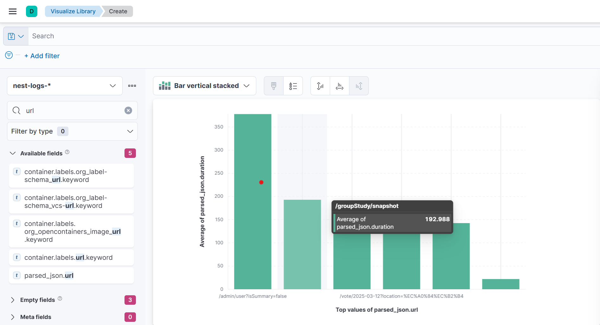
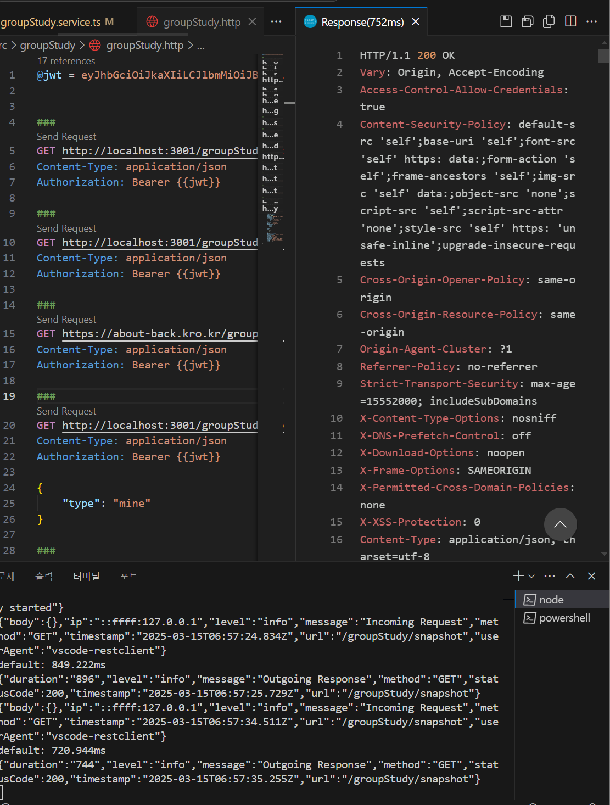
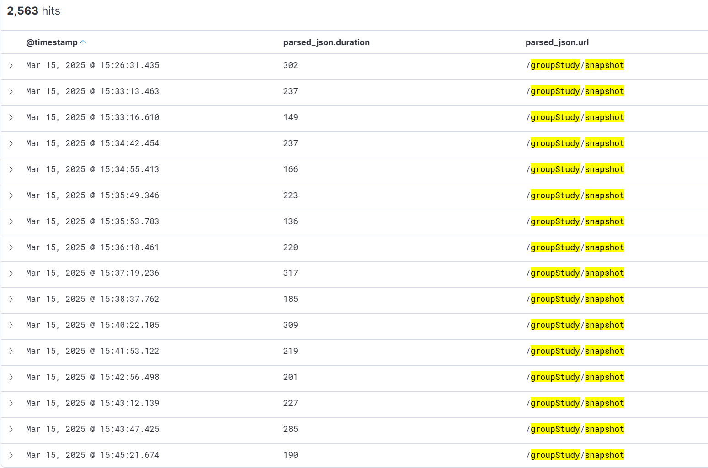
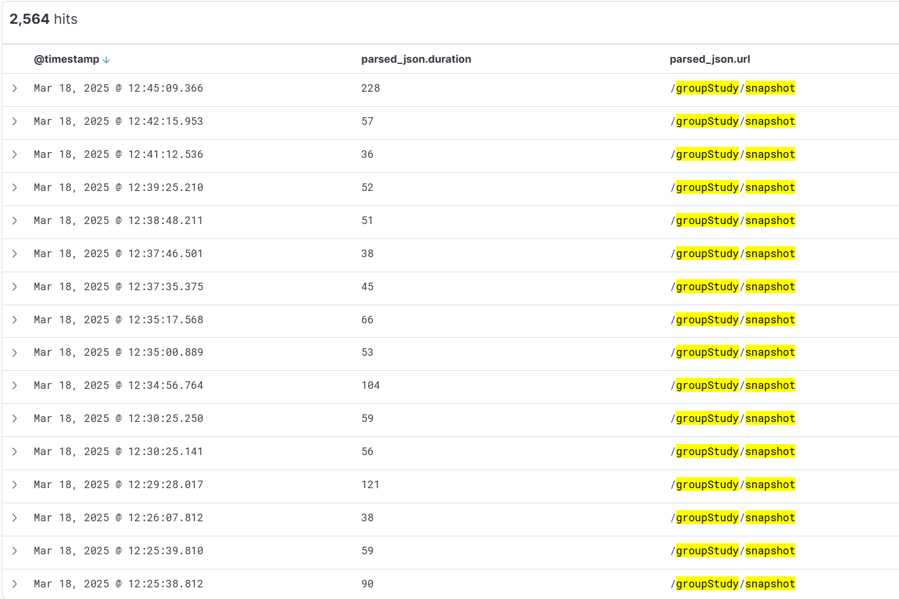

# 시간이 오래걸리는 API를 찾아내보자

현재 About 서비스는 Docker에서 생성되는 모든 로그를 ELK 스택으로 수집하고 분석하고 있습니다.
원래는 단순하게 에러 로그만 수집하여 사용했는데, 이를 잘 활용하면 각 API의 처리 속도도 분석해볼 수 있겠다 생각했습니다.

이를 위해서는 먼저 Nest.js로 들어오는 모든 요청의 URL과 실행 시간을 로깅해야 합니다.
그래서 다음과 같은 middleware를 두었습니다.
``` typescript
@Injectable()

export class LoggingMiddleware implements NestMiddleware {
  constructor(
    @Inject(WINSTON_MODULE_PROVIDER) private readonly logger: LoggerService,
  ) {}
  
  use(req: Request, res: Response, next: NextFunction) {
    const startTime = Date.now();
  
    // 요청 로깅 (JSON 형식)
    this.logger.log({
      timestamp: new Date().toISOString(),
      level: 'info',
      message: 'Incoming Request',
      method: req.method,
      url: req.originalUrl,
      ip: req.ip,
      userAgent: req.headers['user-agent'],
      body: req.body,
    });
  
    res.on('finish', () => {
      const duration = Date.now() - startTime;
  
      // 응답 로깅 (JSON 형식)
      this.logger.log({
        timestamp: new Date().toISOString(),
        level: 'info',
        message: 'Outgoing Response',
        method: req.method,
        url: req.originalUrl,
        statusCode: res.statusCode,
        duration: `${duration}`,
      });
    });
  
    next();
  }
}
```

- 요청이 들어올 때, ip timestamp url등의 정보를 기록합니다.
- 요청이 종료될 때, url과 duration등의 정보를 기록합니다.

이 middleware를 Global로 적용한다면, 들어오고 나가는 모든 요청을 로깅하게 됩니다.

# 이 로그를 Kibana에서 어떻게 시각화할 수 있을까요?

ELK 스택은 잘 구성돼있다 가정하겠습니다.

먼저, ElasticSearch는 인덱스 생성 시 특별한 설정이 없다면 데이터를 text타입으로 저장합니다. 이 text 타입은 문자가 분해되어 저장되기 때문에, 시각화에 사용하기 어렵습니다. 그래서 시각화할 필드의 타입을 다르게 바꿔줘야 합니다.

타입은 수정이 불가능하기 때문에, reindexing 하는 과정이 필요합니다.
아래 명령은 새로운 template를 적용하는 명령입니다. 이 template이 적용된 후 생성되는 index에는 변경된 타입이 반영됩니다.
```
PUT _template/nest-logs-template
{
  "index_patterns": ["nest-logs-*"], 
  "mappings": {
    "properties": {
      "parsed_json.duration": {
        "type": "integer"
      }
    }
  }
}

PUT _template/nest-logs-template
{
  "index_patterns": ["nest-logs-*"], 
  "mappings": {
    "properties": {
      "parsed_json.url": {
        "type": "keyword"
      }
    }
  }
}
```
- 먼저,  Duration 필드를 integer type으로 지정합니다. 숫자 타입으로 인식되기 때문에, 최대값, 평균값등 분석에 사용할 수 있습니다.
- url 필드를 keyword type으로 지정합니다. 문자열은 기본적으로 text 타입으로 저장되어 tokenize되지만, keyword type을 지정하면 문자 자체를 저장합니다. 따라서 url을 분석 대상으로 사용할 수 있습니다.

다음으로, 기존 index들을 reindexing 해줘야 합니다. template이 적용돼있으므로 바뀐 type이 적용된 index가 생성됩니다.
```
POST _reindex
{
  "source": {
    "index": "nest-logs-2025.03.09"
  },
  "dest": {
    "index": "nest-logs-2025.03.09-reindexed"
  }
}
```

이 과정이 모두 성공했으면 이제 url과 duration을 시각화에 사용할 수 있습니다.

이제 아래의 과정을 거치면 각 url 별로, 평균 처리 시간을 확인할 수 있습니다.

1. 햄버거 메뉴에서 visualization library를 선택하여 create 버튼을 누른 후, Lens를 선택합니다.
2. parsed_json.url(이름 다를 수 있음) 필드를 드래그 하여 놓으면, Horizontal axis가 "Top values of parsed_json.url"로 설정됩니다.
3. 오른쪽의 Vertical axios 를 선택한 후, Average와 parsed_json.duration을 선택합니다.

그럼 아래와 같은 그래프가 완성됩니다.


먼저 시간이 가장 오래걸린 /admin/user/~는 모든 유저 정보를 가져오는 관리자가 사용하는 api입니다. 속도가 느려도 유저들이 체감할 수 없습니다.

그 다음으로 속도가 느린 api는 /groupstudy/snapshot 요청입니다. Groupstudy의 데이터를 populate해서 전부 가져오는 요청인데, 자주 호출되고 매우 큰 양의 데이터를 가져옵니다. 이 api의 속도를 한번 개선해봅시다.

# Redis 캐싱을 적용해보자.

/groupstudy/snapshot은 groupstudy의 모든 데이터를 가져온 후, 메인페이지에서 사용하기 좋게 가공하는 과정을 포함합니다. groupstudy의 모든 데이터가 양이 크고 가공하는 로직이 포함돼있어서 시간이 오래걸린다고 생각해볼 수 있습니다.

그렇다면 가공된 데이터 전체를 Redis에 캐싱하면 어떨까요?


아래 이미지는 /groupstudy/snapshot api를 로컬에서 여러번 실행했을 때 걸리는 시간입니다. 보통 800ms 전후로 실행되는걸 확인할 수 있었습니다.



한번 코드에 Redis 캐싱을 적용해보겠습니다.
``` typescript
async getGroupStudySnapshot() {
	let groupStudyData;
	groupStudyData = await this.redisClient.get(GROUPSTUDY_FULL_DATA_KEY);
    if (groupStudyData) {
      return await JSON.parse(groupStudyData.toString());
    }
    
	//그 외 로직
	
	this.redisClient.set(
      GROUPSTUDY_FULL_DATA_KEY,
      //returnVal은 최종 가공된 데이터가 들어갑니다.
      JSON.stringify(returnVal),
      'EX',
      60 * 30,
    );
    
	return returnVal;
}
```

Redis가 적용되는 로직만 작성했습니다.
GROUPSTUDY_FULL_DATA_KEY값의 데이터가 있는지 확인하고, 있다면 그 값을 return 합니다.
그리고 데이터가 없다면, 모든 과정을 마친 후 최종 데이터를 GROUPSTUDY_FULL_DATA_KEY를 key로하여 저장합니다.

# 이제 API 요청이 빨라졌을까?

결론부터 말하면, 이 방식을 적용한 후 오히려 API 응답 속도가 1000ms대로 느려졌습니다(로컬 기준).

그 원인에 대해 생각해본 결과, 최종 결과 데이터가 너무 크기 때문에 네트워크 전송 속도, Redis에서 읽고 쓰는 속도 등이 영향을 준 것이 아닐까 생각했습니다.

그렇다면 이를 어떻게 해결할 수 있을까요?
압축을 사용하면 됩니다.

# 데이터를 압축하여 다시 캐싱해보자

아래는 수정된 코드입니다.
``` typescript
const gzip = promisify(zlib.gzip);
const gunzip = promisify(zlib.gunzip);

async getGroupStudySnapshot() {
	let groupStudyData;
    groupStudyData = await this.redisClient.get(GROUPSTUDY_FULL_DATA);
  
    if (groupStudyData) {
      return await JSON.parse(
        (await gunzip(Buffer.from(groupStudyData, 'base64'))).toString(),
      );
    }
    
   //그 외 로직
	this.redisClient.set(
      GROUPSTUDY_FULL_DATA,
      (await gzip(JSON.stringify(returnVal))).toString('base64'),
      'EX',
      60 * 30,
    );

	return retuenVal;
}
```
압축을 위해 zlib 라이브러리를 사용했습니다.

압축한 데이터를 캐싱하는 코드를 적용했습니다. 추가적인 처리를 하고 실행시간을 확인해봅시다.

# 캐싱된 데이터에 추가적인 처리가 필요합니다.

캐싱기능이 완료됐을까요? 아직 아닙니다.
캐싱은 말 그대로 데이터를 그대로 캐시에 저장하고 있는 것입니다. 
데이터에 변경이 일어나도 캐싱된 데이터는 변경되지 않기때문에, 이 부분의 처리가 필요합니다.
지금은 누군가 groupstudy를 만들거나 참여해도, 유저한테 보이지 않을 것입니다.

저는 이 문제를 /groupstudy로 GET이 아닌 요청이 들어올 경우, 캐싱된 데이터를 삭제하여 해결했습니다.

Nest.js에서는 middleware로 이 문제를 해결해도 되고, Interceptor로 해결할 수도 있습니다. 저는 Interceptor 방식을 선택했습니다.

``` typescript
export class GroupStudyInterceptor implements NestInterceptor {

  constructor(
    @Inject(REDIS_CLIENT)
    private readonly redisClient: Redis,
  ) {}
  intercept(
    context: ExecutionContext,
    next: CallHandler<any>,
  ): Observable<any> | Promise<Observable<any>> {
    const request = context.switchToHttp().getRequest();
  
    if (request.url.startsWith('/groupStudy') && request.method !== 'GET') {
      this.redisClient.del(GROUPSTUDY_FULL_DATA);
    }
    return next.handle().pipe();
  }


@UseInterceptors(GroupStudyInterceptor)
export class GroupStudyController {
}
```
이렇게 Interceptor를 적용해두면, groupstudy 데이터가 변경되면 캐싱된 데이터가 사라집니다.

# 결과를 확인해보자

아래는 캐싱 적용전 /groupStudy/snapshot으로 들어오는 요청의 처리시간입니다.

평균을 구해보면 225.2초입니다.

아래는 캐싱 적용 후 요청의 처리시간입니다.

평균을 구해보면 104.9입니다.

처리시간을 2배이상 줄일 수 있었습니다.
단순히 봐도 처리시간이 확연히 준 것을 알 수 있습니다.
# 앞으로는?

제가 사용중인 Redis 서버는 Ram 1GB 인스턴스에서 작동하고 있습니다.
그래서 많은 데이터를 캐싱하기에는 좋지 않습니다.
앞으로 같은 방법으로 duration 분석을 통해, 시간이 오래 걸리는 요청을 찾아내고, 그 부분을 캐싱하는 방식으로 활용해보려 합니다.