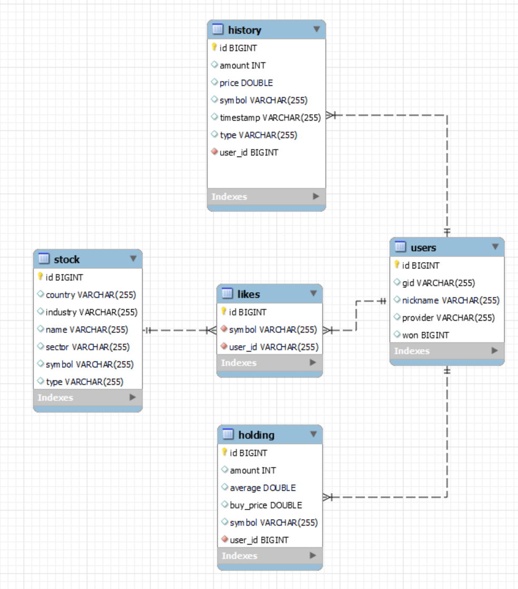

최근 주식에 관심을 많이 가지면서, 주식 거래 시뮬레이터를 만들어보면 재밌겠다 생각했습니다.
기술 스택으로 Spring boot와 MySQL을 사용할 예정이어서 간단히 데이터베이스를 설계해보려 합니다.

# 주식 시뮬레이터에 어떤 기능이 필요할까?

요구사항을 파악하고 프로젝트를 진행하는게 아니므로, 제가 만들고싶은 기능을 요구사항으로 생각하고 데이터베이스를 설계해야 합니다. 꼭 필요한 기능들을 정리해봅시다.

## 사용자는 로그인을 할 수 있어야 한다.

로그인은 간단히 처리하기 위해 구글 로그인만을 제공할 예정입니다.
## 사용자는 주식 정보를 확인할 수 있어야한다.

주식의 현재가, 당일 최고가, 최저가, 거래 내역 등을 확인할 수 있으면 좋겠습니다.
## 사용자는 주식을 사고 팔 수 있어야 한다.

구매 수량을 지정하여, 주식을 사고 팔 수 있어야 합니다.
## 사용자는 보유 중인 주식을 확인할 수 있어야 한다.

자신이 주식을 얼마에 구매했고, 몇 개를 보유하고 있는지 확인할 수 있어야 합니다.
## 미국주식과 한국주식을 모두 지원해야 한다.

최근 미국주식에 대한 관심이 높아서, 미국주식 기능도 지원하고 싶습니다.
## 관심 주식을 등록할 수 있어야 한다.

관심 주식은 좀 더 자주 확인하므로, 유저의 편의를 위해 제공합니다.

# 요구사항에서 Entity를 뽑아내자

## User
먼저 유저정보는 꼭 필요할 것입니다.
요구사항을 분석했을 때 다음과 같은 데이터가 필요할 것으로 보입니다.

- provider: 어떤 방식으로 로그인 했는지 구분합니다.
- won: 보유한 돈의 정보입니다. 주식을 구매하기 위해 필요합니다.

## Stock

- country: 주식이 상장된 곳을 구분합니다.
- industry
- name
- sector
- symbol
- type

위의 정보들은 주식 정보를 크롤링할 때, 필요한 정보들을 뽑아냈습니다.

## Holding

사용자가 어떤 주식을 들고있는지에 대한 정보가 필요합니다.

- userId: 유저와의 관계를 나타냅니다.
- amount: 몇개 들고있는지 나타냅니다.
- average: 평균단가가 얼마인지 나타냅니다.
- symbol: 주식의 symbol입니다.

## History

주식 거래는 돈을 다루는 민감한 일이므로, 사고파는 모든 정보를 기록해두면 좋을것 같습니다.

- amount: 구매, 판매 수량을 나타냅니다.
- price: 얼마에 구매했는지 나타냅니다.
- symbol: 어떤 주식을 구매했는지 나타냅니다.
- timestamp: 구매 시간을 나타냅니다.
- type: 구매인지 판매인지 구분합니다.
- userId: 누구의 데이터인지 구분합니다.

## Like

- symbol: 어떤 주식인지 나타냅니다.
- userId: 누구의 데이터인지 나타냅니다.

# ER 다이어그램을 작성해보자.

이제 데이터베이스에 어떤 Entity와 속성이 필요한지 파악했으므로, ER 다이어그램을 만들어봅시다.

저는 MySQL Workbench를 사용하였습니다.

위에서 추출한 Entity를 생성하고, Entity들 간의 Relationship을 표현했습니다.
한 user는 여러개의 history, like, holding을 가질 수 있습니다. 그리고 각 주식은 여러개의 like를 가질 수 있습니다. 이를 1대 다 관계로 표현했습니다.

데이터 구조가 복잡하지 않고, 3정규형까지 위반하는 내용이 없기에 정규화는 생략해도 괜찮을것 같습니다.

# 테이블을 물리적으로 설계하자

Spring boot와 JPA를 사용할 예정이기 때문에, Spring 코드 상에 Entity를 구현하고 연결해주면 자동으로 MySQL에 테이블이 생성될 것입니다.

User Entity를 어떻게 정의할지 예시로 살펴봅시다.
getter, setter는 생략했습니다.
```java
package com.stock.stock_simulator.entity;  
  
import jakarta.persistence.*;  
  
@Entity  
@Table(name = "Users", indexes = {  
        @Index(name="idx_gid", columnList = "gid")  
})  
public class User {  
    @Id  
    @GeneratedValue(strategy = GenerationType.IDENTITY)  
    private Long id;  
  
    @Column(unique = true, nullable = false)  
    private String gid;  
    private Long won;  
    private String nickname;  
    private String provider;  
  
    //getter, setter
  
    @Override  
    public String toString() {  
        return "User{" +  
                "id='" + id + '\'' +  
                ", gId='" + gid + '\'' +  
                ", won='" + won + '\'' +  
                ", nickname='" + nickname + '\'' +  
                ", provider='" + provider + '\'' +  
                '}';  
    }  
}
```