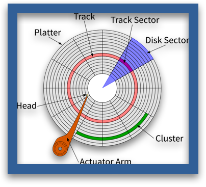

조합 논리는 입력에 의해서만 출력이 결정된다.
조합 논리만으로는 흐름의 일부분을 떼어내서 기억할 수 없기 때문에 컴퓨터를 만들 수 없다.
순차 논리는 입력의 현재 상태와 과거 상태를 함께 고려한다.

## 시간 표현과 상태 기억

현실에서는 주기를 이용해 시간을 측정할 수 있다.
컴퓨터 공학은 전자공학을 사용하기 때문에 주기적인 전기 신호가 필요하다.

### 발진자

인버터의 출력을 입력에 되먹임 한것이다. 따라서 출력이 0과 1사이를 진동한다.
크리스탈을 사용하면 발진자를 만들 수 있다. 크리스탈을 전극에 연결하고 압축하면 전기를 만들어낸다. 반대로 전극에 전기를 가하면 크리스탈이 구부러진다.(피에조 전기 효과, 압전 효과)

### 클록

시간을 셀 수 있게 해주는 신호.
회로의 페이스를 결정함

시간을 정확히 측정하는 이유

- 비디오를 일정한 속도로 플레이 하고 싶어서
- 전파 지연을 고려해 결과가 안정적이고 올바르다고 확신할 수 있는 시점이 될 때까지 최악의 경우를 가정해 지연 시간을 기다림

지연시간의 편차를 고려해 컴퓨터 부품들을 빈에 나눠 담는다.
오버클로킹: 빈의 중간정도에 위치하는 부품이 고장 나지 않을 범위에서 클록을 빠르게 공급

### 래치

1비트를 기억하는 방법

- OR 게이트 래치
  
  out이 1이라고 가정하자. 앞으로 래치를 사용할 때는 초기값을 가정해야 하는 경우가 많다.
  in이 1로 변경되면 out도 1로 변경된다.
  in 값이 변하는 것과 관계없이 out은 1로 유지되므로, 이 회로는 1을 기억한다.

그러나 이 래치는 out을 다시 0으로 만들 방법이 없기 때문에 추가 작업이 필요하다.

- AND-OR게이트 래치
  
  ~reset이 로우이면 reset이 하이이므로, OR게이트의 출력은 OR게이트의 입력에 되먹임 된다.
  ~reset이 하이이면 되먹임이 깨지므로 out은 0이 된다.

- S-R래치
  
  간단하게 회로를 해석해보면, set이 0, reset이 0인 경우 상태를 저장, set이1, reset이 0인 경우 Q에 1출력, set이 0, reset이 1인 경우 Q에 0 출력. set, reset모두 1인 경우 비정상 입력이다.

  XOR게이트로 입력이 액티브 하이인 S-R래치도 만들 수 있지만, NAND게이트를 사용하는 것이 더 간단하고 전력 소모가 적다.

### 게이트가 있는 래치

S-R래치에 게이트를 추가하면, ~gate가 참인 상태에서는 입력의 변화가 그대로 출력에 나타나고, 거짓인 상태에서는 입력이 변해도 출력에 변화가 없다.

### 플립플롭

데이터 변경으로 인해 잘못된 결과가 생길 수 있는 가능성을 최소화 하자. (게이트가 열려 있는 동안에 상태를 바꾸지 않도록)

- 에지: 논리 수준이 한 수준에서 다른 수준으로 전이되는 중간에 데이터를 잡아 내는 것.
- 플립플롭: 에지에 의해 데이터 변화가 촉발되는 래치

- D플립플롭: 양의 에지(0 -> 1)에 의해 변화가 촉발되는 플립플롭

### 카운터

플립플롭을 응용한 회로 중 하나. 순서대로 수를 센다.

- 리플 카운터: 개수를 센 결과가 왼쪽에서 오른쪽으로 퍼짐. 비동기 카운터라고도 함. 전파 지연으로 뒤로 갈 수록 결과 얻는 속도가 느려짐.
- 동기적 카운터: 상태 변경이 동시에 일어난다. 즉, 모든 플립플롭을 같은 클록에 병렬로 연결함.

### 레지스터

클록을 공유하는 여러 D플립플롭을 한 패키지에 넣은 것.

## 메모리 조직과 주소 지정

레지스터보다 훨씬 많은 정보를 저장해야 한다면 어떻게 해야 할까?

- 레저스터를 많이 쌓아둔다.
  어떤 레지스터를 사용할지 어떻게 지정할까? 각 레지스터에 번호를 부여해서 주소로 사용한다. 주소를 입력받아 디코더로 레지스터를 선택한다.
  다음으로 지정한 주소에 해당하는 레지스터의 출력을 선택해야 한다. 이는 실렉터를 사용하여 할 수 있다.
  
  연결을 줄이기 위해, 입력과 출력의 연결을 합치고, read/~write 신호를 통해 제어한다. enable 제어 신호는 메모리 전체를 켜거나 꺼서 여러 메모리 칩을 함께 연결하게 해준다.
  주소와 데이터에 큰 화살표를 이용한 이유는 비트를 대량으로 이동시키는 교통 수단, **버스**를 표현하기 위함이다.

또 다른 문제는 메모리 크기가 늘어나면 주소로 연결해야 할 비트 수도 많아진다는 것이다. 메모리의 내부 위치는 주소를 행, 열로 나눠서 관리한다.

열 주소 디코더, 행 주소 디코더로 행과 열을 지정한다.
훨씬 더 많은 메모리가 있다면 행과 열 주소를 멀티플렉싱 하면 주소 라인의 수를 반으로 줄일 수 있다.

### 임의 접근 메모리(RAM)

지금까지 우리가 살펴본 메모리를 임의 접근 메모리 라고 부른다.

- 정적 RAM(SRAM): 비싸지만 아주 빠르다. 각 비트에 트랜지스터가 6개 들어간다.
- 동적 RAM(DRAM): 커패시터(capacitor)라는 아주 작은 버킷에 전자를 담고, 트랜지스터를 1개만 사용해 뚜껑을 덮는다. 이 버킷은 새기 때문에 가끔 메모리를 갱신해야 한다. 집적도다 높기 때문에 큰 메모리 칩에 사용된다.

둘 다 휘발성(전원이 끊어지면 데이터가 사라지는) 메모리이다.

### 읽기 전용 메모리(ROM)

한 번만 쓸 수 있는 메모리가 더 정확한 표현이다.

- 홀러리스 카드: 종이에 구멍을 뚫어 비트를 표시.
- 코어 로프 메모리: 아폴로 호 비행 제어. 바느질을 통해 비트를 기록. 전자기 간섭의 영향 받지 않음.
- 마스크 프로그래머블 ROM: 비트 패턴을 반도체 제조사에 보내면 비트 패턴을 마스크로 바꿔서 칩을 만들어 돌려준다.
- 프로그래머블 ROM(PROM): 직접 프로그래밍 할 수 있지만 단 한 번만 가능.
- 지울 수 있는 PROM(EPROM): 오류난 PROM이 산더미 산더미처럼 쌓이는것 방지. 특별한 자외선 빛 아래에 두면 저장된 내용 지울 수 있음.
- 전기로 지울 수 있는 EPROM(EEPROM): 지우는 과정이 느리지만 전기로 지울 수 있음. 기술적으로는 RAM임.

## 블록 장치

### 디스크 드라이브

자화된 판을 이용해 비트를 저장한다.

- 디스크 헤드: 손 역할
- 블록: 섹터라고 불림. 디스크에서 읽고 쓰기가 가능한 가장 작은 단위.
- 비트 밀도: bit/mm^2. 바깥쪽 트랙은 비트 밀도가 낮기 때문에 공간이 낭비된다. 최근 디스크는 방사상 영역으로 구분해 이 문제를 해결한다.
- 탐색 시간:헤드를 한 트랙에서 다른 트랙으로 옮길 때 걸리는 시간.

방금 헤드를 지난 데이터가 다시 필요할 경우 한바퀴 회전 기다려야 한다.
기계 부품이 시간이 갈수록 낡는다.

### 자기 테이프

자화시킨 테이프를 감은 릴을 사용

### 광학 디스크

데이터를 읽고 쓰기 위해 자성 대신 빛을 사용. 같은 데이터를 포함하는 디스크를 대량으로 찍어낼 수 있다.
CD, DVD

## 플래시 메모리와 SSD

### 플래시 메모리

가장 최근 나타난 EEPROM 유형의 매체. DRAM처럼 버킷에 전자를 담지만, 버킷을 잘 만들어서 전자가 새지 않는다. RAM처럼 원하는 위치를 맘대로 읽을 수 있다.
0을 1로 바꿀 수는 있지만, 전체를 지우지 않고 원하는 비트만 0으로 되돌릴 수는 없다. 모든 메모리를 지우는 것은 낭비가 심하므로, 블록 단위로 접근할 수 있다.
즉, 읽을 때는 임의 접근, 쓸 때는 블록 접근 장치이다.

### SSD (고체 상태 드라이브)

디스크 드라이브 모양의 패키지에 넣은 플래시 메모리.
여러 블록의 쓴 횟수를 기억해서 모든 블록이 가능하면 똑같은 수준으로 낡도록 조정하는 프로세서가 들어있다.

## 오류 감지와 정정

한 줄기의 우주 방사선이 언제 메모리에 닿아서 비트가 잘못될 지 알 수 없다.

### 패리티

1비트 오류 감지 가능. 데이터에서 1로 설정된 비트의 수를 세고, 그 개수가 짝수인지 홀수인지 나타내는 1비트를 덧붙인다.

- 짝수 패리티: 모든 값을 XOR
- 홀수 패리티: XOR한 값의 보수

### 해밍 코드

### 체크섬

정적인 데이터 블록을 검사함.
데이터의 각 지점을 n비트 값으로 더하고, n비트를 넘어가는 값은 무시한다. n이 크면 클수록 위양성(데이터 블록에 오류가 있는데 오류가 없다고 판단하는 경우) 발생 확률이 줄어든다.

### 순환 중복 검사

### 해시 코드

## 하드웨어와 소프트웨어 비교

- 펌웨어: ROM에 담긴 소프트웨어를 가리키는 말이었으나, 플래시 메모리, RAM상에도 존재함.
