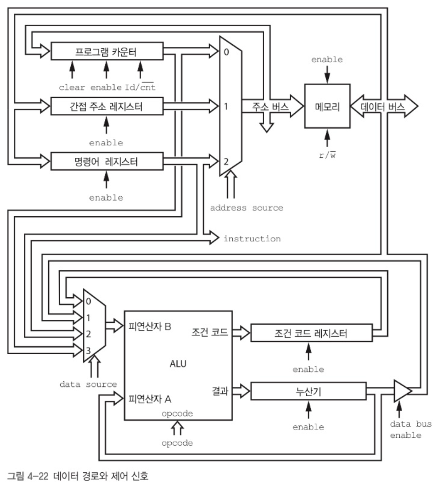

메모리, 입력과 출력, CPU 세 가지 부분이 서로 어떻게 연관되는지 살표보자

## 메모리

조작할 비트들을 저장할 장소.
메모리는 집이 빈틈 없이 늘어선 거리와 같다.
모든 집은 크기가 똑같고, 정해진 개수만큼 비트를 저장할 수 있다.
각 집에는 주소가 있다.
메모리의 기본 단위는 바이트 이지만, 꼭 바이트로 읽어야 하는 것은 아니다. 32비트 컴퓨터는 4바이트 덩어리로 읽는다. 한 번에 많이 읽으면 더 많은 양의 데이터를 처리할 수 있다.

컴퓨터 메모리 구조를 이런 관점으로 볼 수도 있다.
5,6,7,8과 같이 두 집에 걸쳐 데이터에 접근하는 경우를 **정렬에 맞지 않는 접근** 이라고 한다. 이런 경우 한 번에 접근할 수 없고 두 번 왕복 해야한다.
버스의 각 자리에는 누가 앉을까? 이는 사용하는 프로세서에 따라 달라진다.
**엔디안** 이라는 단어가 이런 차이를 표현한다.

- 리틀 엔디안: 바이트3 - 바이트2 - 바이트1 - 바이트0
- 빅 엔디안: 바이트0 - 바이트1 - 바이트2 - 바이트3
  따라서 시스템간 데이터 전송 시에는 엔디안을 염두해 두어야 한다.

## 입력과 출력

- I/O: 입력과 출력의 줄인 말
- 주변장치: I/O에 연결 되는 장치들
  컴퓨터에는 I/O 처리를 위한 별도의 거리가 존재한다.
  최근에는 메모리 거리의 주소 수가 훨씬 많아지면서, 빈 주소가 많아졌다. 따라서 이제는 메모리 거리 중 일부를 I/O장치에 할당하는 것이 타당해졌다.
  아무도 사용하지 않는 주소를 몇몇 지역으로 나눠서, 각 슬롯에 할당된 장치는 자신에게 할당된 주소를 모두 사용할 수 있게 한다.

## 중앙 처리 장치

실제 계산을 처리하는 컴퓨터 부품. 도심에 해당함.

### 산술 논리 장치(ALU)

산술 계산, 불리언 대수 및 기타 연산 수행법을 알고 있는 장치.

- 피연산자: 수를 표현하는 비트
- 명령코드(연산코드): 어떤 연산자 적용할지 지정.
- 결과: 피연산자에 연산자를 적용한 결과
- 조건 코드: 결과에 대한 추가정보가 들어감.
  조건 코드 레지스터라는 레지스터에 조건코드 저장됨.
- 레지스터: 메모리 거리가 아닌 다른 곳에 존재하는 메모리
- 조건 코드 레지스터
  ㅡ ㅡ ㅡ ㅡ ㅡ N Z O
  N비트는 마지막으로 수행한 연산 결과가 음수인 경우 1로 설정
  Z비트는 마지막 연산 결과가 0인 경우 1
  O비트는 마지막 연산에서 오버플로나 언더플로가 생기면 1

### 시프트

- 왼쪽 시프트: 어떤 숫자의 모든 비트를 왼쪽으로 1비트 옮긴다.
- 오른쪽 시프트: 어떤 숫자의 모든 비트를 오른쪽으로 1비트 옮긴다.
  클록에 따라 내용을 1비트씩 시프트하는 시프트 레지스터를 플립플롭으로 만들 수 있다. -> 8:1실렉터 8개를 사용한 배럴 시프터로 해결 가능.

### 실행 장치(제어 장치)

메모리의 정해진 장소에서 명령코드와 피연산자들을 가져와서 ALU에게 해야할 일을 알려준다.
"위치 10에 있는 수를 위치 12에 있는 수와 더한 결과를 위치 14에 저장하라"같은 명령어 목록을 가져온다. 어디서 가져올까?
메모리에서 찾을 수 있다. 이런 방식을 **프로그램 저장 방식 컴퓨터**라고 부른다. 그럼 메모리에서 명령어를 가져오는 위치는 어떻게 알까?
**프로그램 카운터**를 사용한다. 이도 레지스터의 일종이다.
프로그램 카운터에는 메모리 주소가 들어있는데, 실행 장치는 프로그램 카운터가 가르키는 주소에서 명령어를 읽어온다. 그 후 프로그램 카운터 값은 증가한다.
CPU마다 초기 프로그램 카운터 값이 있고, 전원을 키면 이 값으로 세팅된다.

## 명령어 집합

명령어를 명령코드, 두 피연산자, 그리고 결과라는 네 가지 필드로 나누자.

### 3주소 레지스터

- 명령코드 4비트
- 피연산자B 4비트
- 피연산자A 4비트
- 결과
  이렇게 필드를 나누면, 결과와 피연산자를 16주소밖에 쓸 수 없어서 제대로 사용할 수 없다.
  또한 세 가지 메모리 위치를 한꺼번에 지정하는 접근을 사용한다. 주소 버스와 데이터 버스를 각각 3개씩 둬야 하는데, 이는 작동할 수 없는 구조이다.
  -> 한 번에 한 메모리 위치에만 접근할 수 있게 하면 좀 더 많은 비트를 주소에 사용할 수 있다.
  레지스터 거리에 다른 집을 추가하여 이를 구현할 수 있다.
  이 레지스터를 **누산기**라고 부른다. 누산기는 ALU가 계산한 결과를 저장한다.

### 1주소 레지스터

- 명령코드 4비트
- 주소 12비트
  두 메모리 위치에 있는 값 사이에 연산을 수행해서, 결과를 다른 메모리에 넣는 대신, 한 메모리 위치와 누산기에 있는 값을 연산해서 누산기에 값을 저장한다.

### 주소 지정 모드

누산기를 사용하면 12비트를 주소 지정에 사용할 수 있지만, 여전히 충분하지 않다. 이런 방식으로 주소를 가르키는 경우를 **직접 주소 지정**이라고 한다.

- 직접 주소 지정: 주소를 직접 가리키는 경우
- 간접 주소 지정: CPU 명령어에 들어있는 값을 피연산자 주소로 해석하지 않고, 피연산자 주소를 얻을 수 있는 메모리 위치를 가리키는 주소로 사용.
- 즉시 주소 지정 모드: 주소에 해당하는 비트를 그냥 값으로 간주.

### 조건 코드 명령어

아직 조건 코드를 다루는 명령어에 대해 설명하지 않았다.
조건 코드를 원하는 값으로 설정하거나, 조건 코드의 값을 살펴볼 수 있는 방법이 필요하다.

- cca: 조건 코드 레지스터의 값을 누산기로 복사
- acc: 누산기의 값을 조건 코드 레지스터에 복사

### 분기 명령어

지금까지 배운걸로는 명령어를 처음부터 끝까지 순서대로 수행할 수밖에 없다.
프로그램 카운터의 값을 바꿀 수 있는 명령어를 분기 명령어 라고 한다.

### 최종 명령어 집합 구성

- 모드 2비트
- 명령코드 4비트
- 주소 10비트

주소 지정 모드가 3가지 있으므로 2비트가 필요하다.
명령코드에는 분기 명령어가 포함 돼있다.

## 마지막 설계

지금까지 만든 것들을 모아 컴퓨터로 만들어 보자. 모두 함께 작동하려면 접착제에 해당하는 요소가 필요하다.

### 명령어 레지스터

명령어를 실행하려면 컴퓨터 내부에서는 어떤 일이 벌어져야 할까? 이를 두 단계로 나뉘어진 상태 기계로 설명할 수 있다.

- 패치 <--> 실행
  처음에 컴퓨터가 해야 할 일은 메모리에서 명령어를 가져오는 **패치**이다. 명령어를 가져오고 나서는 어떻게 실행해야 할지 고민해야 한다.
- 명령어 레지스터: 현재 실행중인 명령어를 저장
- 프로그램 카운터 -> (주소 버스) -> 메모리 -> (데이터 버스) -> 명령어 레지스터

### 데이터 경로와 제어 신호

프로그램 카운터의 값을 메모리 주소 버스에 넣을 방법과 메모리에 있는 데이터를 명령어 레지스터로 넣을 방법이 필요하다.

+) 간접 주소 레지스터: 간접 주소 지정을 사용할 때, 메모리에서 읽어온 주소 저장.

### 데이터 흐름 제어

## RISC와 CISC명령어 집합

명령어가 복잡해지면서, 컴퓨터 제어 회로도 복잡해졌다. 통계적으로 분석한 결과, 복잡한 명령어 중 상당수는 거의 쓰이지 않는다는 사실을 발견했다.

- RISC: 프로그램의 실행시간을 대부분 차지하는 명령어만을 포함하는 기계.
- CISC: 기존 설계 방식으로 만든 컴퓨터
  RISC는 **적재-저장 구조**를 사용한다. 메모리와 레지스터를 오가는 명령어들과 레지스터 간 명령어로만 이뤄진 구조이다.
  RISC에 새로운 명령어를 추가하면서 최근의 RISC는 예전 CISC보다 훨씬 복잡해졌다.

## GPU

그래픽 처리 장치
비디오를 매끄럽게 처리하려면 몇백만 개가 넘는 지점을 초당 60회 이상 계속 그려야 한다.
그래픽 처리는 아주 특화된 작업이기 때문에 CPU의 모든 기능이 필요하진 않다.

1. GPU에는 간단한 처리 장치가 아주 많이 들어 있다.
2. GPU는 CPU보다 메모리 버스의 폭이 더 넓다. -> 메모리에 더 빠르게 접근 가능
