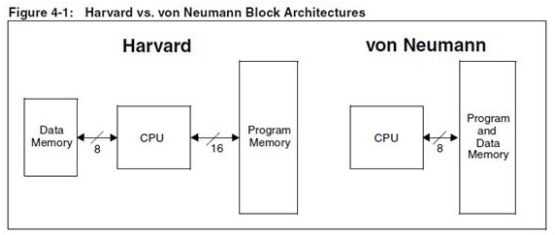

- 컴퓨터 아키텍처: 컴퓨터의 여러 구성 요소를 배치하는 방법.

# 기본적인 구조 요소들

- 폰 노이만 구조
- 하버드 구조
  둘의 차이는 메모리 배열 뿐이다. 폰 노이만 구조는 메모리에서 명령어와 데이터를 동시에 가져올 수 없어서 조금 더 느리지만, 하버드 구조는 이를 처리하기 위한 버스가 하나 더 필요하다.

## 프로세스 코어

위 그림의 CPU는 하나뿐이다. 단일 CPU보다 높은 성능을 얻기 위해 멀티프로세서라는 개념이 탄생했다. 그러나 여러 CPU를 활용할 수 있도록 프로그램을 병렬화 하는 문제는 일반적인 경우 풀 수 없는 문제다.
반도체 크기가 줄어들면서 성능은 좋아졌지만, 전력 소모와 단위 면적당 열 발생이 많아지며 프로세서는 전력 장벽에 부딪힌다.
이를 해결하기 위해 CPU를 추가했는데, 이젠 CPU를 프로세스 코어라고 부르고, 코어가 여럿 들어가는 멀티코어 프로세서가 이젠 일반적으로 쓰인다.

## 마이크로 프로세서와 마이크로 컴퓨터

- 마이크로프로세서: 메모리와 I/O가 프로세서 코어와 같은 패키지에 들어있지 않음
- 마이크로 컴퓨터: 모든 요소를 한 침에 패키징
  그러나 이런 용어의 경계가 뚜렷하진 않다.
  마이크로 프로세서는 보통 큰 시스템에 들어가는 부품으로 쓰이고, 마이크로 컴퓨터는 식기세척기 등에서 찾을 수 있는 작은 컴퓨터다.

# 프로시저, 서브루틴, 함수

셋은 우리가 관심을 갖는 범위 안에서는 같은 것을 뜻한다.
함수는 코드의 반복을 없애기 위해, 코드의 유지보수가 쉽도록 하고싶을 때 사용할 수 있다.
함수를 작동시키기 위해서는 함수를 호출하는 부분에서 함수를 실행하고 다시 원래 자리로 돌아올 방법이 필요하다.
어디서 함수로 들어 갔는지를 어떻게 기억할까? 이 위치는 바로 프로그램 카운터의 값이다.

# 스택

함수가 또 다른 함수를 호출하는 경우가 있다. 지금까지는 반환값을 저장할 위치가 한군데 뿐이기 때문에 이미 들어 있던 반환 값을 덮어쓰면 되돌아갈 위치를 잊어버린다.
그래서 재귀 함수 같은 것들이 잘 작동하려면 반환 주소를 여럿 저장할 수 있어야 한다. 그리고 함수에서 호출 지점으로 반환할 때 저장된 주소 중 어떤 주소를 사용할지도 결정할 수 있어야 한다.
여기서 우리는 **스택**을 사용할 수 있다. 스택은 LIFO(Last In Frist Out)자료구조이다.
스택에 주소를 푸시하는데 더 이상 들어갈 공간이 없으면 이를 **스택 오버플로**, 빈 스택에서 주소를 꺼내려 하는 경우(pop) 이를 **스택 언더플로**라고 부른다.
스택은 단순히 반환 주소만 저장하지는 않는다. 지역 변수도 함께 저장해야 한다.
이렇게 함수가 호출될 때마다 스택에 저장되는 데이터들의 모음을 **스택 프레임**이라고 한다.
+) 수식을 표현하는 기법에는 중위 표기법, 전위 표기법(폴란드 표기법), 후위 표기법(역 폴란드 표기법)이 있는데, 스택을 사용하면 후위 표기법을 쉽게 구현할 수 있다.

# 인터럽트

요리 중에 배달기사가 오는지를 확인해야 한다고 가정하자.

- 순서도: 해야할 일을 작업이 이뤄지는 순서로 표현.
- 폴링: 배달 기사가 왔는지 계속 확인
- 인터럽트: 해야할 일이 생기면 잠깐 중단시켜서 외부 요소에 대응. 알림벨 느낌.
  인터럽트 시스템은 적절한 신호가 들어오면 CPU 실행을 잠깐 중단시킬 수 있는 핀이나 전기 연결을 포함.

## 인터럽트 작동

1. CPU가 주의를 기울여야 하는 주변장치는 인터럽트 요청을 생성
2. 프로세서는 보통은 현재 실행 중인 명령어를 끝까지 실행
3. 실행 중인 프로그램을 잠시 중단시키고 **인터럽트 핸들러**라는 전혀 다른 프로그램을 실행.
4. 인터럽트 핸들러가 작업을 마치면 원래 실행 중이던 프로그램이 중단된 위치부터 다시 실행
5. 인터럽트 핸들러는 함수다.

## 고려 사항

1. 언터럽트에 대한 응답 시간: 인터럽트 작업에 너무 긴 시간을 할애하면 원래 작업에 차질이 생김.
2. 인터럽트를 서비스하고 다시 돌아오려면 현재 상태를 저장할 방법이 필요. 레지스터에 저장돼 있던 값도 기억해야 한다. 스택을 통해 이를 해결한다.

컴퓨터는 어떻게 인터럽트 핸들러의 위치를 찾을까?
보통 인터럽트 핸들러 주소를 저장하기로 한 메모리 주소가 존재. 이 주소에는 여러 **인터럽트 벡터**가 들어있다.
많은 기계가 스택 오버플로나, 메모리 예외 상황에 대한 인터럽트 백터를 제공한다.

- 마스크: 인터럽트를 중단시킬 수 있음.
- 우선순위: 인터럽트가 많이 있는 경우, 우선순위
- 타이머: 일정 시간이 지나면 인터럽트 발생시킴

# 상대 주소 지정

여러 프로그램을 동시에 실행하려면 각 프로그램을 전환시켜줄 관리자 프로그램이 필요하다.
이를 운영체제 또는 운영체제 커널이라고 부른다.
우리는 OS를 시스템 프로그램이라 부르고, 다른 모든 프로그램을 사용자 프로그램, 혹은 프로세스라고 부른다.

- OS작동
  1. 사용자 프로그램을 메모리로 읽기
  2. 상태 복원
  3. 사용자 프로그램 실행
  4. 타이머 인터업트
  5. 사용자 프로그램 중단
  6. 상태저장 -> 1번으로
- 시분할: 프로그램의 실행 시간을 조절하는 스케줄링 기법. 시간을 정해진 간격으로 나누고, 정해진 시간동안 사용자 프로그램을 실행.
- 사용자 프로그램 상태, 문맥: 레지스터의 상태와 프로그램이 사용 중인 메모리의 상태

프로그램을 메모리로 불러들이려면 시간이 걸린다. 프로그램을 메모리로 불러오되, 각 프로그램에게 각기 다른 공간을 허용할 수 있으면 훨씬 더 빠르게 시분할 실행이 가능하다.
사용자 프로그램을 어떻게 하나씩 차례로 메모리에 올릴 수 있을까? 절대 주소 지정을 사용하면 1000번지에서 실행되도록 만들어진 프로그램을 2000번지에 읽어 들이면 제대로 실행되지 않을 것이다.

- 인덱스 레지스터: 인덱스 레지스터에 들어있는 값 + 명령어에 들어 있는 주소 = 유효 주소
- 상대 주소 지정: 명령어에 들어 있는 주소를 0부터 시작하는 위치로 해석하지 않고, 명령어의 주소를 기준으로 하는 상대적인 주소로 해석한다. 예를 들어, 100이라는 주소를 1번지에 저장하려면, 100을 저장하지 않고 99를 저장하는 것이다.

# 메모리 관리 장치

이제는 멀티태스킹이 필수이다.
인덱스 레지스터와 상대 주소 지정이 도움이 될 수 있지만 충분하진 않다.
만약 사용자 프로그램2에 버그가 있어서 1의 메모리를 덮어쓰거나 한다면 어떤 일이 벌어질까?
이런 상황을 아예 발생하지 않게 하면 좋다.
이를 위해 오늘날 마이크로프로세서에는 대부분 메모리 관리 장치(MMU)가 들어 있다.

- MMU: 가상 주소와 물리 주소를 구분.
  프로그램 -> (가상 주소) -> 메모리 관리 장치 -> (물리 주소) -> 메모리

## 작동 방식

MMU는 가상 메모리 주소를 두 부분으로 나눈다.

- 하위 부분: 물리적 주소 범위와 같다.
- 상위 부분: 페이지 테이블이라는 RAM 영역을 통해 주소를 변환.

- 페이지 테이블: 각 페이지가 물리 메모리상에서 차지하는 실제 위치 정보 들어있음.
  모든 내용은 페이지 경계 안에 있어야 한다.
  프로그램 입장에서는 가상 메모리가 연속적인 것처럼 보이지만, 실제 메모리에서 연속일 필요는 없다. 프로그램이 실행되는 도중에 프로그램이 위치한 물리적 메모리 주소가 바뀔 수도 있다. 프로그램들이 서로 협력하는 경우 여러 프로그램의 가상 메모리 중 일부가 같은 물리 메모리를 함께 공유하는 **공유 메모리**기능을 제공할 수도 있다.

현대적 프로세서의 MMU는 페이지 테이블 크기가 정해져 있다.
MMU에 제어 비트를 추가할 수도 있다.

- 실행 불가 비트: 켜져 있으면 CPU가 이 페이지에 있는 명령어를 실행할 수 없다. 따라서 프로그램이 자기 데이터를 실행하는 경우를 막을 수 있따. 이는 보안에 좋다.
- 읽기 전용 비트

- 페이지 폴트 예외: 물리적 메모리에 연관되지 않은 주소에 접근할 때 발생. 스택 오버플로 등에 유용.
  MMU가 등장하며 폰 노이만 구조와 하버드 구조의 구분이 의미 없어졌다. 단일 메모리 버스만 사용하는 폰 노이만 구조도 명령어 메모리와 데이터 메모리를 분리해 제공할 수 있다.

# 가상 메모리

OS는 희소한 하드웨어 자원을 사용하려고 경합하는 프로그램들 사이의 자원 분배를 관리한다.
OS는 MMU를 사용해 사용자 프로그램에게 가상 메모리를 제공한다.
페이지 폴트 메커니즘으로 인해 프로그램은 필요한 만큼 많은 메모리가 있다고 생각할 수 있게 된다.

## 요구불 페이징

- 요청 받은 메모리가 사용 가능한 메모리의 크기보다 크면? OS는 현재 필요하지 않은 메모리 페이지를 더 느리지만 용량이 큰 대용량 저장장치인 디스크로 옮긴다.(swap out)
- 스왑 아웃한 페이지에 프로그램이 접근하면 운영체제는 필요한 메모리 공간을 확보하고 요청받은 페이지를 다시 메모리로 불러들인다(swap in).
  이를 스와핑이라 하는데, 스와핑이 일어나면 시스템 성능이 크게 저하된다. 이런 성능 저하를 막기 위해 여러 알고리즘이 사용된다.
- LRU: 최소 최근 사용: 최근에 가장 자주 사용된 페이지는 물리 메모리에 그대로 두고, 최근에 가장 덜 사용한 페이지를 스왑 아웃 함.

# 시스템 공간과 사용자 공간

멀티태스킹 시스템은 모든 프로그램에게 자신이 컴퓨터 안에서 실행되는 유일한 프로그램이라는 환상을 심어준다. 그러나 I/O 장치가 끼어들면 이런 환상을 유지하기 힘들어진다.
사용자 프로그램이 MMU의 설정을 마음대로 바꿀 수 있다면 MMU가 프로그램을 제대로 격리하지 못할 것이다.
여러 CPU는 이를 해결할 추가 하드웨어를 제공한다.

- 컴퓨터가 시스템 모드인지 사용자 모드인지 결정하는 비트가 레지스터에 있다. I/O를 처리하는 명령어 등 일부는 특권 명령어라서 시스템 모드에서만 실행할 수 있다.
- 트랩, 시스템 콜: 사용자 모드에서 실행중인 프로그램이 시스템 모드 프로그램에게 요청 보냄.

이 방법은 장점이 있다.

1. 사용자 프로그램으로부터 OS, 다른 사용자 프로그램을 보호
2. 사용자 프로그램이 MMU등에 손을 댈 수 없기에 OS가 프로그램에 대한 자원 할당을 전적 제어
