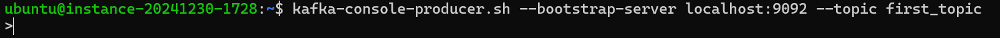
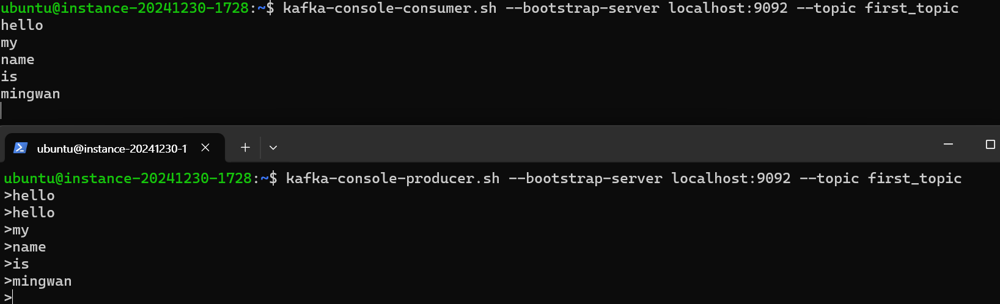

Commandline Interface에서 어떻게 kafka를 동작시키는지 간단히 알아봅시다.
[hello](https://beming-dev.github.io/subCategory/about/)

kafka가 설치돼있고, 환경변수를 등록해서 bin경로 없이 kafka명령을 실행할 수 있는 환경을 가정한다.
# Kafka Broker

## Broker 시작
```cmd
kafka-server-start.sh ~/kafka_2.12-3.9.0/config/kraft/server.properties
```
server.properties 파일 정보를 사용해서 kafka-server-start script를 실행시킨다.

# Topics

## topic 생성
```
kafka-topics.sh --bootstrap-server localhost:9092 --topic first_topic --create
```
bootstrap-server를 지정해주고, topic 이름을 지정해주며 kafka-topics script를 실행한다. 

## partition 개수, reprication factor 지정
```
kafka-topics.sh --bootstrap-server localhost:9092 --topic first_topic --create --partitions 3 --replication-factor 1
```
다음과 같이 partition 개수와 replication-factor를 지정해주며 topic을 생성할 수 있다. 
- broker 개수보다 큰 수의 replication-factor는 지정 불가

## topic list 보기
```
kafka-topics.sh --bootstrap-server localhost:9092 --list
```
다음과 같이 list 명령을 사용하면 생성된 topic들의 이름을 확인할 수 있다.

하나의 topic의 세부 사항을 보고싶다면 describe 옵션을 사용하면 된다.
```
kafka-topics.sh --bootstrap-server localhost:9092 --topic first_topic --describe
```

## topic 삭제

```
kafka-topics.sh --bootstrap-server localhost:9092 --topic first_topic --delete
```

# Producer

producer와 관련해서는 kafka-console-producer.sh script를 사용한다.
## producer 생성
```
kafka-console-producer.sh --bootstrap-server localhost:9092 --topic first_topic
```
다음 명령으로 first_topic에 대한 producer를 생성할 수 있다.


다음과 같이 입력할 수 있는 > Interface가 표시되고, 여기에 메시지를 입력해서 topic으로 전송할 수 있다.

존재하지 않는 topic에 대해 producer를 생성하면, server.properties의 기본 설정에 따라 topic이 자동생성됨.
실수 방지를 위해 error를 반환하도록 이 기능은 꺼두는게 좋음.

## acks 설정

```
kafka-console-producer.sh --bootstrap-server localhost:9092 --topic first_topic --producer-property acks=all
```
--producer-property 옵션으로 property를 지정하여 producer를 생성할 수 있다.
위와 같이 명령하면 acks가 all이므로 모든 broker의 확인을 받게 된다.

## roundrobin 방식 사용
```
kafka-console-producer.sh --bootstrap-server localhost:9092 --producer-property partitioner.class=org.apache.kafka.clients.producer.RoundRobinPartitioner --topic first_topic
```
## key 지정

```
kafka-console-producer.sh --bootstrap-server localhost:9092 --topic first_topic --property parse.key=true --property key.separator=:
```
":" 을 기준으로 key value를 지정하겠다는 의미이다.

">" 표시에 key:velue(ex)name: mingwan) 과 같은 형식으로 데이터를 전송하면 key가 입력된다.

# Consumer

## consumer 생성
```
kafka-console-consumer.sh --bootstrap-server localhost:9092 --topic second_topic
```
위의 명령을 생성하면 CLI가 대기 상태로 진입한다.
producer를 통해 메시지가 topic에 생성되면, consumer에도 표시된다.


다음과 같이 2개의 CLI창을 띄워두고 하나는 producer, 하나는 consumer로 생성을 하면 다음의 동작을 확인할 수 있다.

## 처음 메시지부터 보기
consumer를 켜면 켜진 시점부터 받은 데이터만 표시된다. 모든 데이터를 확인하려면
```
kafka-console-consumer.sh --bootstrap-server localhost:9092 --topic second_topic --from-beginning
```
다음과 같이 불러오면 된다.

partition이 여러개라면 partition간의 순서는 고려되지 않고 데이터가 읽히므로, 순서가 뒤죽박죽일 수 있다.

## key, value, timestamp 표시
```
kafka-console-consumer.sh --bootstrap-server localhost:9092 --topic second_topic --formatter kafka.tools.DefaultMessageFormatter --property print.timestamp=true --property print.key=true --property print.value=true --property print.partition=true --from-beginning
```
복잡해 보이지만, timestamp, key, vlaue, partition정보를 true로 하고 defaultMessageFormatter로 출력하도록 지정하는 간단한 코드이다.

이렇게 하면 메시지 정보가 다른 정보들을 포함해서 display된다.

# consumer group

## consumer group 생성
```
kafka-console-consumer.sh --bootstrap-server localhost:9092 --topic second_topic --group my-first-application
```
second_topic에 대해 my-first-application이라는 이름의 group에 consumer를 생성한다.
같은 group에 여러 consumer를 생성하고 메시지를 보내면 메시지가 번갈아서 표시되는걸 확인할 수 있다.

## consumer group list 확인
여기서 부터는 kafka-consumer-groups.sh script를 사용한다.
```
kafka-consumer-groups.sh --bootstrap-server localhost:9092 --list
```

## group의 상세정보 확인

```
kafka-consumer-groups.sh --bootstrap-server localhost:9092 --describe -group my-second-application
```

## +
group을 지정하지 않고 consumer를 생성하면 임시 consumer group이 생성되고 거기에 consumer가 할당된다.
잠시 후 사라지기 때문에 이 group을 사용해서는 안된다.