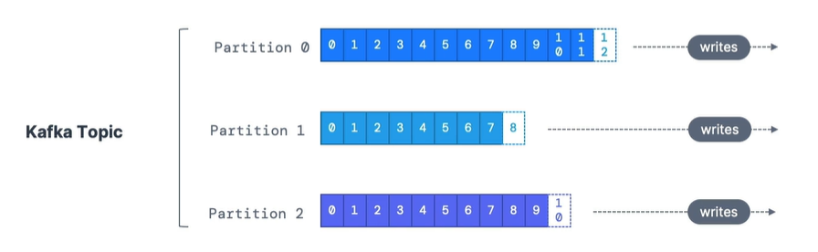
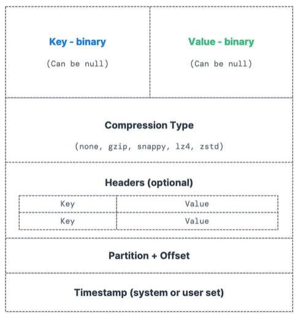
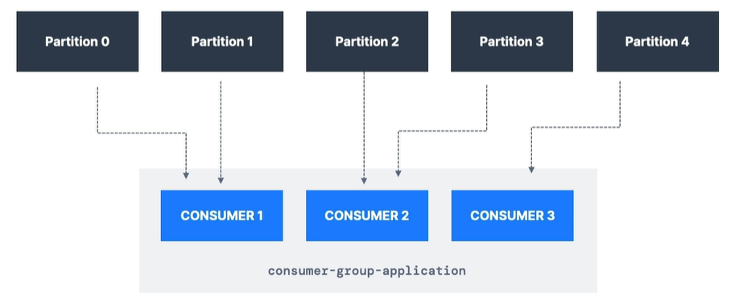
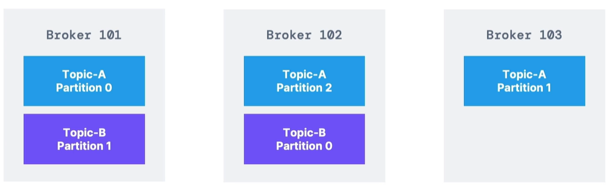
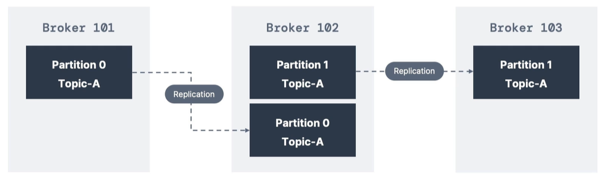

# Kafka Topics

데이터의 stream
원하는 만큼 많이 가질 수 있음.
이름으로 식별
sequence of messages = data stream

## partitions
 

각각의 메시지는 partition에 할당되고, 고유한 id를 가짐. 이 id를 partition offset이라 부름.
데이터가 partition에 기록되면 삭제, 수정 등 불가(immutability).
데이터는 정해진 limited time동안 기록됨
키가 제공되지 않으면 random partition에 기록됨.

# Producers
topic에 데이터를 적는 주체.
어떤 partition에 데이터를 기록할지 알게됨. broker가 정하는게 아님.
partition이 고장나면 producer가 어떻게 복구할지 알고있음.

key=null이면, round robin방식. partitions에 차례대로 하나씩 기록
key 제공되면 해싱. 동일한 키는 동일한 partition으로 기록.

## message anatomy

kafka 메시지는 다음과 같은 구조를 가집니다.

## Kafka Message Serializer

 kafka는 입출력으로 byte만 사용.
 따라서 Serializer가 입, 출력을 Serialize, 해줌.
 key, value에 대해 적용됨.

# Consumers
Topic에서 data를 읽는 주체. - pull model

Deserializer를 이용해서 Deserialize하여 프로그래밍 언어가 읽을 수 있는 형태로 변환.

producer 단계에서부터 타입이 잘 정의되어 있어야 함. Topic의 타입 변경 불가.

## consumer groups

같은 topic을 읽는 consumer들의 group.

같은 topic을 읽는 여러개의 consumer group도 존재 가능.
보통 service당 하나의 consumer group 갖게 됨.

## Consumer offsets

kafka는 consumer group이 읽고 있던 offset을 저장. 
어디까지 읽었는지 offset을 commit
## Delivery semantics for consumer

default JAVA - automatically commit offsets (at least once)
수동
- At least once: 최소한 한 번 메시지가 처리된 직후 offset commit. 메시지를 다시 처리할 수도 있음.
- At most once: consumer가 메시지를 받자마다 offset commit. 처리가 잘못되면 메시지 잃음
- Exactly once:  메시지를 딱 한번 처리

# Brokers

Kafka cluster는 다수의 brokers로 이루어짐.
broker = server
ID로 식별됨
각 broker에는 특정한 topic partitions만 담김 -> 데이터가 모든 broker에 걸쳐서 분산됨.
하나의 bootstrap broker에 연결되면, 전체 kafka cluster에 연결됨. -> broker개수 많이 가능.

ex) 3개의 partition을 가진 Topic A와 2개의 partition을 가진 Topic B. 3개의 Broker가 존재한다고 가정.

topic의 partition들이 여러 broker에 저장되는걸 kafka scale이라함.
horizontal scaling - broker, partition이 추가되면 rebalancing됨.

bootstrap server: cluster에 있는 각각의 kafka broker

# Topic replication factor

topic은 1보다 큰 replication factor을 가져야 함.
broker가 down됐을 때, 다른 kafka broker가 사본을 가지고 있어서 그걸 받을 수 있게 됨.

ex) topic A가 2의 replication factor를 갖고 있다고 가정.

102가 고장나면, 101과 103으로부터 복구.

## Leader for a Partition
1개의 broker만 partition의 leader가 될 수 있음.
producer는 leader인 broker에게만 데이터 전송.
ISR: In-sync-Replica. 동기화 돼있는 경우.

# Producer Acknowledgements

producer는 데이터 쓰기 확인을 받을 수 있다. 
- acks = 0: producer가 확인을 기다리지 않음. 데이터 유실 가능
- acks = 1: Leader의 확인을 기다림. 데이터 유실 제한
- acks = all: Leader와 모든 replica의 확인 필요. 데이터 유실 안됨

# Kafka Topic Durability

N의 복제 계수 가지면, N-1개의 broker를 잃어도 클러스터에 데이터 존재

# Zookeeper
최신 버전에서 사라졌지만, 이전 버전에서 여전히 필요.

broker들을 관리함.
leader election 과정에 도움을 줌.
변경이 있을 떄 broker들에게 알림.  

