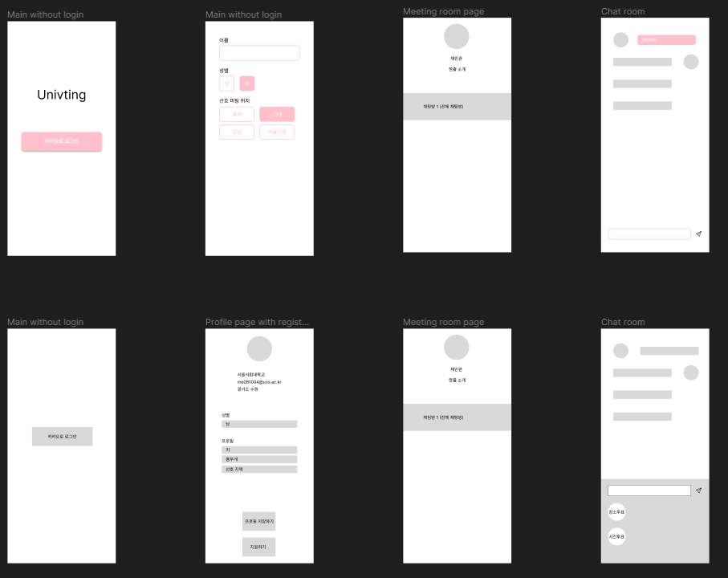

## 와이어프레임

와이어 프레임 이름 그대로 선으로 틀을 잡는 것이다. 간단하게 웹페이지의 구조를 잡는 과정이다.

우리는 mpv설계를 위해 와이어프레임이 필요하고, 아직 디자인이 하나도 정해지지 않은 상태이기 때문에, 동작만 가능한 정도의 간단한 와이어프레임을 설계하기로 했다.

유저플로우를 참고해서 필요한 페이지를 만들었다.

## 도구

figma를 이용해 와이어 프레임을 짰다.

## 설계

와이어 프레임을 기반으로 기능을 구현해보고, 나중에 디자인을 입힐 계획이다.
