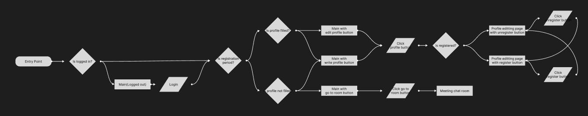

## 유저플로우

유저 플로우란 유저가 우리의 프로그램을 사용할 때, 어떤 식으로 행동할 수 있을지를 설계 해놓은 것을 말한다.

우리는 유저 플로우를 먼저 설계하여 프로젝트의 흐름을 잡고, 유저 플로우를 참고해 와이어 프레임을 만들기로 했다.

## 정의

타원: entry point

다이아몬드: condition (위 갈랫길: Yes, 아래 갈랫길: No)

직사각형: page

평행사변형: action

## 설계

이번 프로젝트에서 중요한 점은 프로젝트가 미팅 신청단계, 미팅 진행단계, 미팅 종료단계로 나뉜다는 점이다.

따라서 미팅 신청단계인지, 프로필이 작성되어 있는지, 미팅에 등록된 상태인지를 고려하여 유저플로우를 설계했다.
